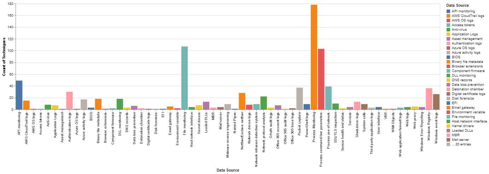

# MITRE-ATTACK-Utils

datasources_vis.py : Python script based on "Attack Python client" notebooks.
* Attack Python Client : https://github.com/hunters-forge/ATTACK-Python-Client

# Requirements
* Python 3+
* Altair graphics library
* Attackcti library

# Usage
You have three arguments:
* grouping : grouping techniques with data sources by data source.
* count : number of data sources per techniques.
* subset : subdata sources.

```
python3 datasources_vis.py --visualization (or -v) (grouping,count or subset)
```

